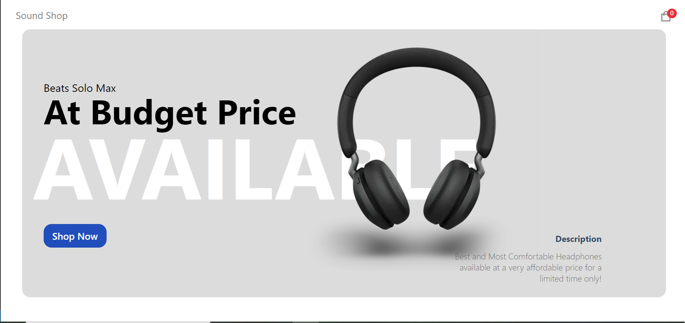

# Introduction

### About the Project:

👉 The project is a fully functional E-commerce Shop made using Next.JS and Sanity CMS mentored by JavaScript Mastery.
 
👉 [Course](https://www.youtube.com/watch?v=4mOkFXyxfsU&t=441s)

### Images:

 
 

 
 

 
 

 
 

# Problems Faced

There were 3 main problems that I faced in making this Project namely:

1. Stripe Integration Problem
2. Some minor styling issues in the Footer Banner
3. Deployment issues with Social media links and favicon issue.

 

# How they were solved:

### 1st Problem:

✅ In this problem, I was constantly getting Integration Error: Uncaught Promise, and was not able to get the solution after reading docs and online material.
 
✅ After going through the Networks tab in Chrome DevTools, I realized that for payments I need to open a business account on stripe, I did that and it worked!
 
 

### 2nd Problem:

✅ I was encountering issues like button going out of div under 400px, no margin between 2 divs under 800px, so I:

1. Shrunk the font size
2. Added margin-left to left div
3. Wrote separate CSS for Footer Banner under 800px
    
    

### 3rd Problem:

✅ Vercel was giving deployment error because I had used target="\_blank" in my social media links so I fixed it via adding rel="noopener noreferrer".
 
❌ Favicon issue is not resolved, problem is that the custom favicon that I inserted is not showing on the site.
 
 

# What I learned by building this Project:

1. npm install --legacy-peer-deps installs exact version of packages mentioned in package.json.
    

2. Under the sanity > schemas folder, You can create your own schemas, import them in schema.js which will be visible in sanity studio also.
    

   - From there, you can add or remove the products directly without writing the backend.
      
      

3. ### Image Hotspot in Sanity:

   - Enables the user interface for selecting what areas of an image should always be cropped, what areas should never be cropped, and the center of the area to crop around when resizing.
   - The hotspot data is stored in the image field itself, not in the image asset, so images can have different crops for each place they are used.

   - Hotspot makes it possible to responsively adapt images to different aspect ratios at display time. The default value for hotspot is false.
      
      

4. ### getServerSideProps:

   - If you export a function called getServerSideProps (Server-Side Rendering) from a page, Next.js will pre-render this page on each request using the data returned by <b>getServerSideProps</b>
   - You should use getServerSideProps only if you need to render a page whose data must be fetched at request time.

   - This could be due to the nature of the data or properties of the request (such as authorization headers or geo location).
   - Pages using getServerSideProps will be server side rendered at request time and only be cached if cache-control headers are configured.
      
      

5. ### getStaticProps and getStaticPaths:

   - If a page has Dynamic Routes and uses getStaticProps, it needs to define a list of paths to be statically generated.

   - When you export a function called getStaticPaths (Static Site Generation) from a page that uses dynamic routes, Next.js will statically pre-render all the paths specified by getStaticPaths.
   - You should use getStaticPaths if you’re statically pre-rendering pages that use dynamic routes and: - The data comes from a headless CMS - The data comes from a database - The data comes from the filesystem - The data can be publicly cached (not user-specific) - The page must be pre-rendered (for SEO) and be very fast — getStaticProps generates HTML and JSON files, both of which can be cached by a CDN for performance.
      
      

6. Creating a Stripe instance and supplying necessary ID will be enough to integrate the stripe to main project.
